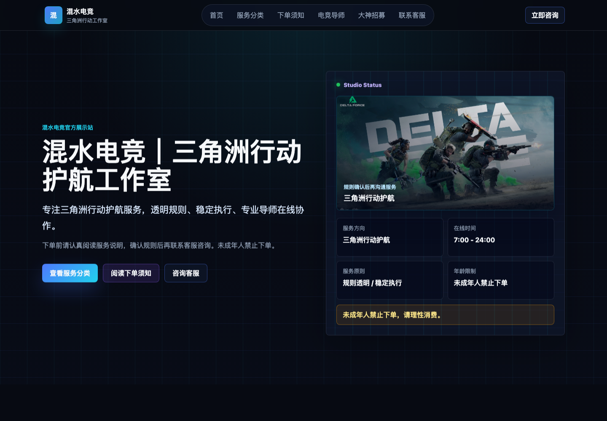

# 混水电竞官网

混水电竞官网是一个面向三角洲行动护航服务的响应式展示站，重点用于服务分类展示、下单规则说明、电竞导师介绍、大神招募和官方客服引导。网站不接入支付，不做抽奖、充值或博彩化功能。

线上地址：[https://esports.xiangfuxing.tech](https://esports.xiangfuxing.tech)



## 功能模块

- 首页首屏：展示工作室定位、服务原则、在线时间和年龄限制提醒。
- 服务分类：按不同护航需求展示服务类型，不直接展示价格。
- 下单须知：分组说明年龄限制、订单规则、配合要求、售后与安全提醒。
- 电竞导师：展示导师名单、风格标签和中性介绍。
- 大神招募：提供前端报名表单和提交反馈。
- 联系客服：引导用户通过官方渠道咨询，避免私下交易风险。

## 技术栈

- React
- Vite
- CSS 响应式布局
- Node.js 测试脚本

## 本地运行

```bash
npm install
npm run dev
```

本地预览默认运行在 Vite 输出的开发地址，例如 `http://127.0.0.1:5173/`。

## 构建与检查

```bash
npm test
npm run build
```

## 项目声明

本网站仅用于工作室服务展示、规则说明与客服引导。请理性消费，未成年人禁止下单。游戏相关权益归原厂商所有。
